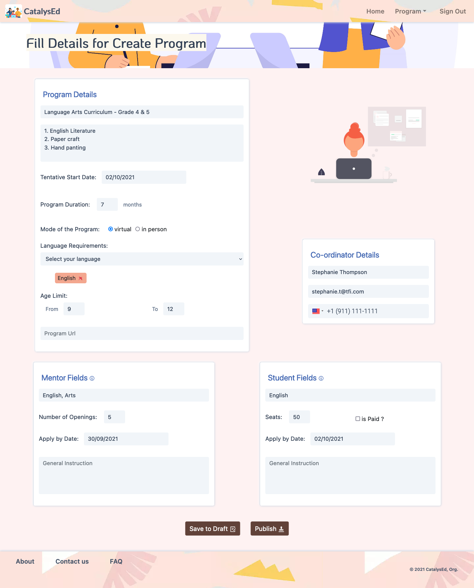
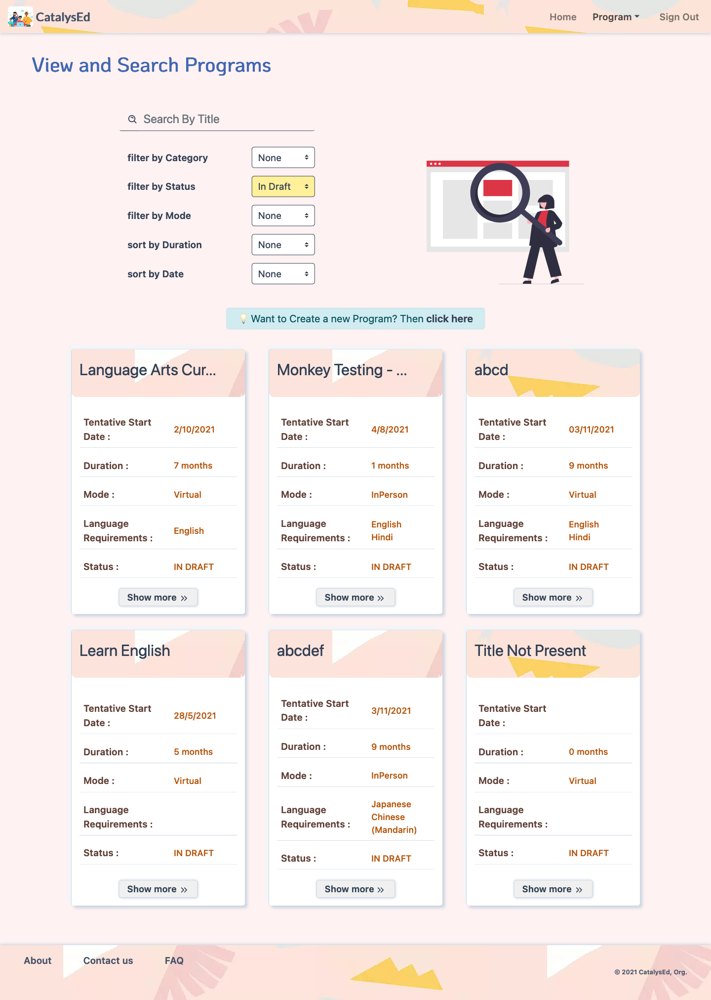
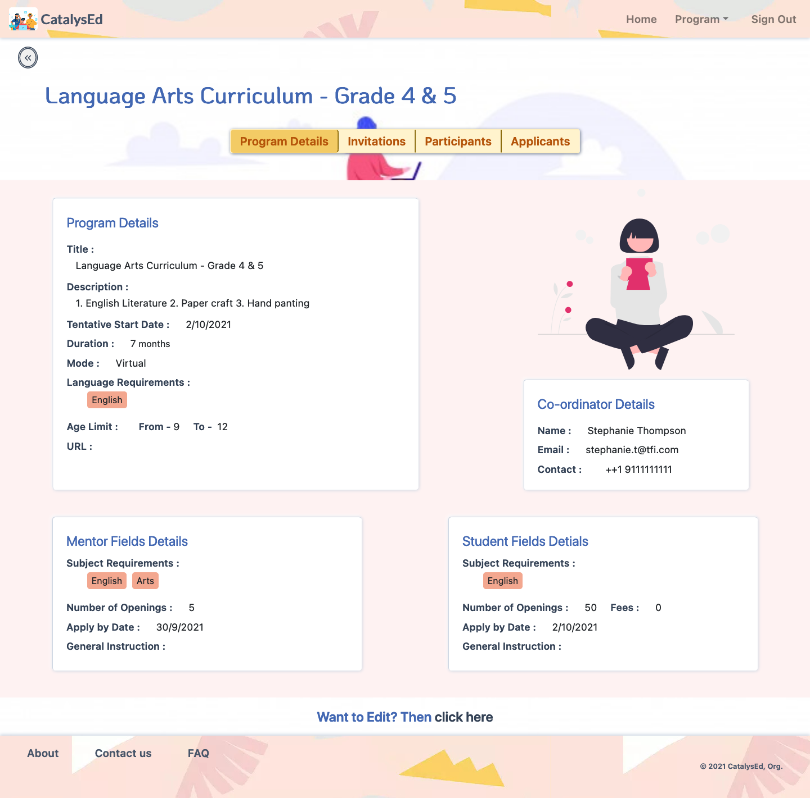
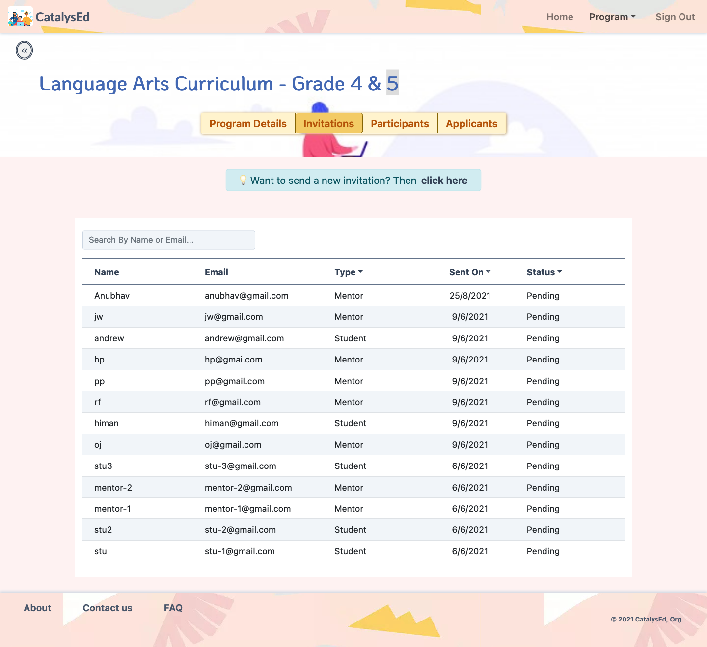
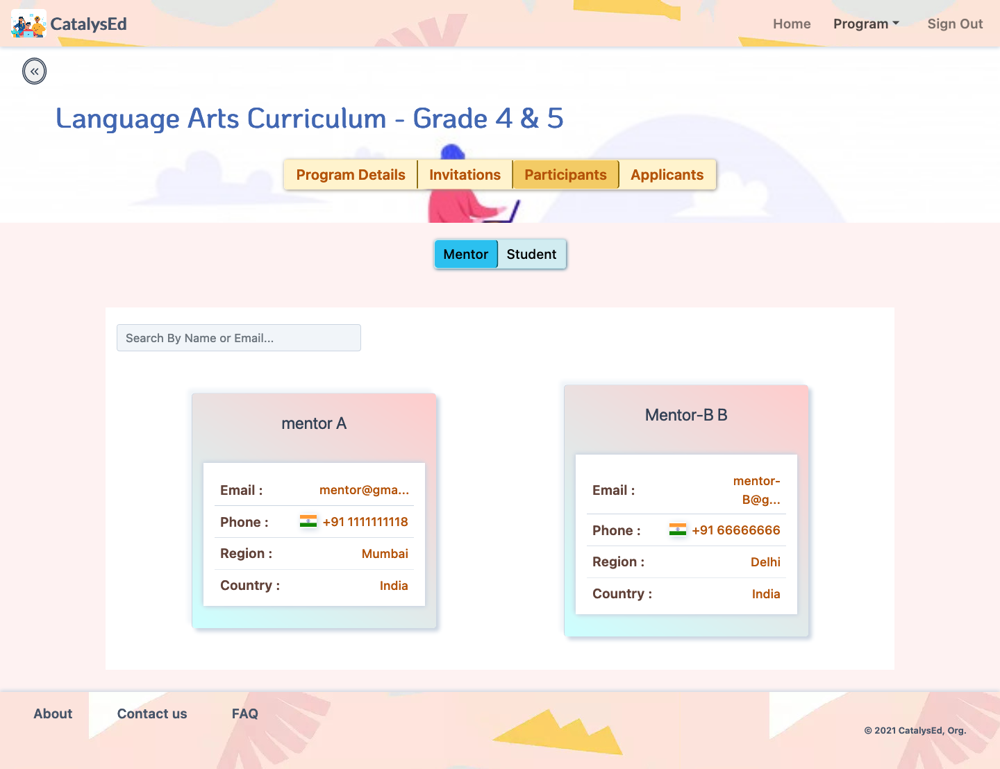
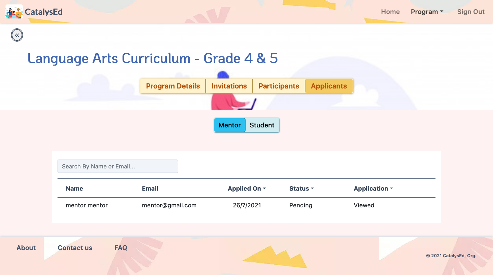
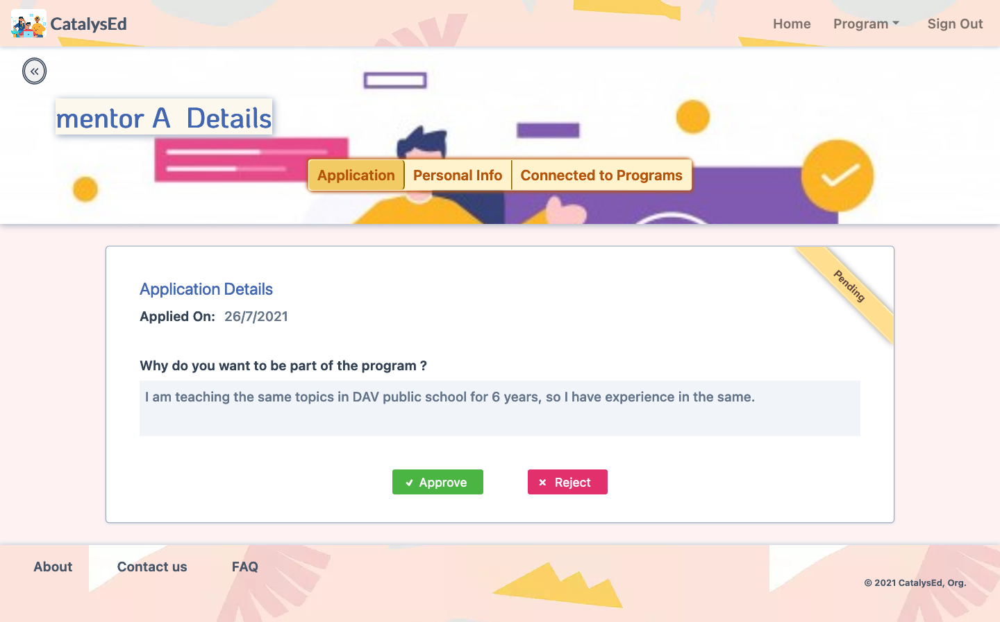

# catalysed-FE
Catalysed is a platform for Not for profit Educational Organizations to run their operations on.
Orgs can create and run their programs on the platform and engage with Mentors and Students through different workflows.

Few of them are listed below, with the appropriate screenshots of the pages.

### 1. Create Program

### 2. Programs Search

### 3. Program Details

### 4. Program Invitations

### 5. Program Participants

### 6. Program Applications

### 7. Application Details

